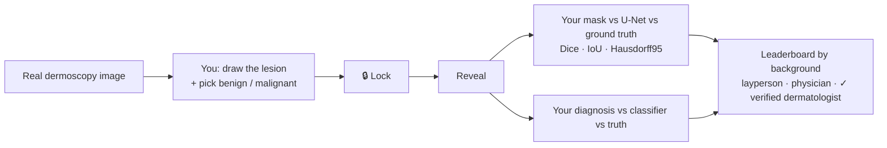
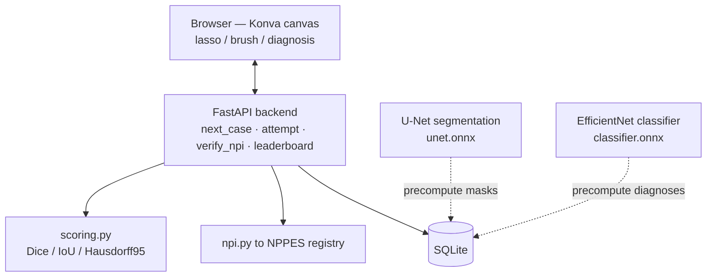

# 🩺 MedVS-AI — Human vs. AI on Medical Images

**An open platform where anyone can go head-to-head with deep-learning models on real medical images — draw the lesion, call the diagnosis, then see how you stack up against the AI and the expert ground truth. Verified clinicians get badged via the public NPI registry, so the leaderboard can ask the real question: _does the model beat actual specialists?_**

> ⚠️ **NOT FOR CLINICAL USE.** This is a research / educational project. No output is a diagnosis.

The current MVP is **dermoscopy** (skin-lesion analysis); the architecture is built to grow into chest X-ray, CT, and MRI — each with the model type that fits it.

---

## Why it's interesting

- **Two real head-to-heads per case.** A **U-Net** competes with you on *segmentation* (drawing the lesion border); an **EfficientNet classifier** competes on *diagnosis* (benign vs. malignant).
- **Credential badging, not gating.** Anyone can play, but enter your **NPI** and we verify it against the free public **NPPES registry** — badging you *physician* or *dermatologist* for real, so human-vs-AI results can be stratified by genuine expertise.
- **Blinded by design (anti-anchoring).** The model's answer is hidden until you **lock** yours. This isn't cosmetic — studies show seeing an AI's (wrong) answer first collapses even expert accuracy, so the blind draw→lock→reveal flow is what makes the comparison honest.
- **Boundary-aware, honesty-first scoring.** Dice + IoU + **Hausdorff95**, framed against the reality that two human experts only agree ~0.75–0.81 Dice — so a 0.78 reads as *"as good as two experts agree,"* not a failure.
- **Grounded in research, not vibes.** Tool design, metric choices, and anti-bias rules come from a literature review of how clinicians actually annotate — see [`docs/ANNOTATION_RESEARCH.md`](docs/ANNOTATION_RESEARCH.md).

## How it works



## Architecture



Predictions are **precomputed at seed time** and served as plain DB/file reads — live play does zero GPU inference.

## The models

| Model | Task | Architecture | Data |
|---|---|---|---|
| **Segmentation** | outline the lesion | U-Net, EfficientNet-B0 encoder (transfer-learned), Dice+BCE loss; benchmarked against a trivial Otsu baseline | ISIC 2018 Task 1 |
| **Classification** | benign vs. malignant | EfficientNet-B0, single-logit, class-weighted (≈ **0.95 val AUROC**) | ISIC 2018 Task 3 / HAM10000 |

Both are trained in self-contained Colab notebooks ([`ml/notebooks/`](ml/notebooks/)) and exported to ONNX for CPU serving.

## Tech stack

**ML:** PyTorch · segmentation-models-pytorch · torchvision · ONNX Runtime · scikit-learn
**Backend:** FastAPI · SQLite (stdlib) · NumPy · SciPy · Pillow
**Frontend:** vanilla JS + [Konva](https://konvajs.org/) (no build step)
**Data:** [ISIC Archive](https://www.isic-archive.com/) · **NPPES** NPI registry

## Repository layout

```
ml/                       # the ML half
  src/                    # Phase 0 dermoscopy U-Net: download, train, baseline, eval, ONNX export
  notebooks/              # Colab notebooks: U-Net spike, ISIC case bundle, benign/malignant classifier
web/
  backend/                # FastAPI app, scoring, NPI verification, ONNX serving, case seeding
  static/                 # the play page (HTML + Konva + CSS)
docs/
  DESIGN.md               # full platform design (per-modality models, badging, comparison engine)
  ANNOTATION_RESEARCH.md  # how clinicians annotate → our UX/scoring decisions (cited)
```

## Run it locally

**1. Train / fetch the models** (free Colab GPU) — see [`ml/README.md`](ml/README.md) and the notebooks in `ml/notebooks/`. Drop `unet.onnx` and `classifier.onnx` into `ml/models/`.

**2. Launch the web loop:**
```bash
cd web/backend
python -m venv .venv && source .venv/bin/activate
pip install -r requirements.txt
python seed_cases.py --synthetic 20     # runs instantly with zero real data
python app.py                            # → http://127.0.0.1:8000
```
For real dermoscopy cases (instead of synthetic), use the ISIC bundle flow in [`web/README.md`](web/README.md).

## Roadmap

- [x] Phase 0 — dermoscopy U-Net segmentation (train → eval → ONNX)
- [x] Phase 1 — web loop: draw + diagnose → blinded reveal → leaderboard
- [x] Benign/malignant classifier (real diagnosis head-to-head)
- [x] **NPI credential badging** via NPPES
- [ ] Public deploy (live URL + collected human-vs-AI data)
- [ ] UX polish (zoom/magnifier loupe, keyboard shortcuts)
- [ ] Second modality — chest X-ray (proving the "different model per modality" thesis)
- [ ] Multi-annotator / STAPLE consensus ground truth

## Data, licensing & ethics

- **Code:** [MIT](LICENSE).
- **Data:** ISIC 2018 / HAM10000 are **CC-BY-NC** (a per-image license mix). Images are **not** redistributed in this repo; you download them yourself via the notebooks, and the app renders per-image attribution. Because the models are trained on CC-BY-NC data, treat them as **non-commercial**.
- **NPI/NPPES:** public data, used only to label background. We persist only a badge, specialty, name-match flag, and the NPI's last 4 digits. NPPES confirms a real provider — it does **not** prove identity.
- **Safety:** a fast, confident AI answer can be wrong; nothing here is a diagnosis or a triage tool. The "NOT FOR CLINICAL USE" framing is load-bearing.

---

_Built as a portfolio + research project exploring when a model's instant reflex beats a thinking human — and when it doesn't._
